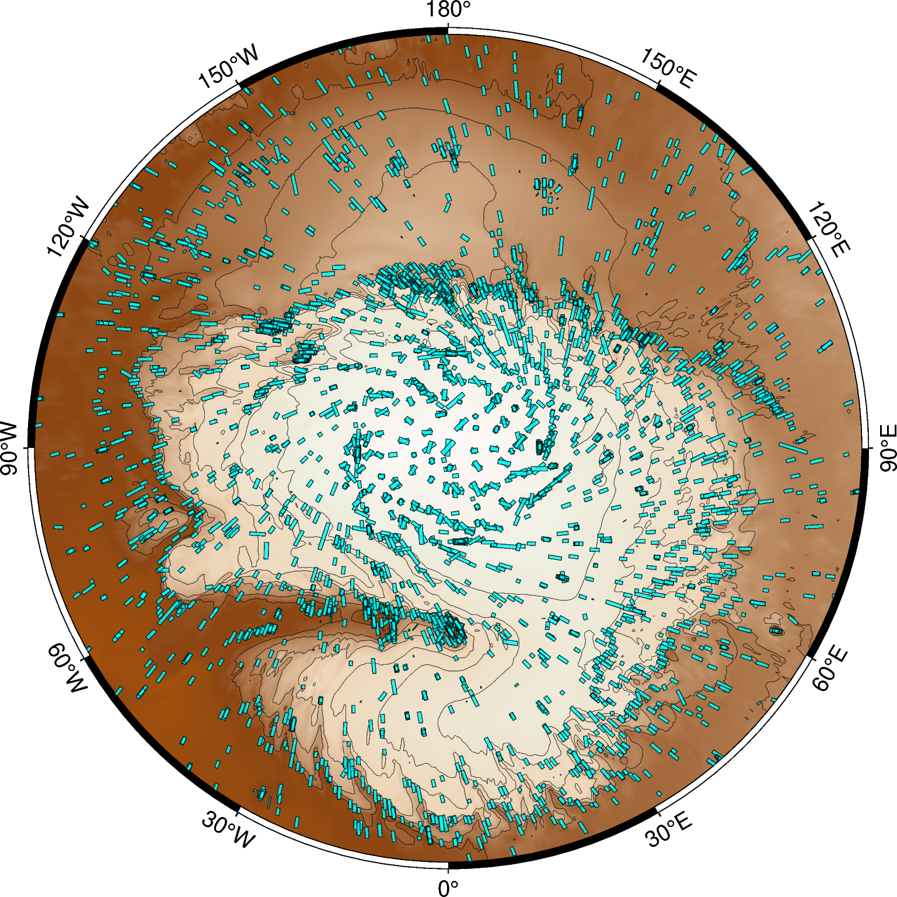

# HiRISE Data Explorer

This repository provides Python tools for filtering, retrieving, and mapping images captured by the High Resolution Imaging Science Experiment (HiRISE) camera onboard the Mars Reconnaissance Orbiter (MRO). Designed for planetary scientists, researchers, and enthusiasts, this toolkit streamlines the process of exploring multi-year image data and identifying areas of interest on the Martian surface.

## :key: Key Features

1. **Custom Filters and Image Retrieval**  
   Effortlessly filter and retrieve large sets of HiRISE images based on user-defined criteria. These custom filters allow you to refine queries by location, date, viewing geometry, and more.

2. **DBSCAN Clustering for Imaging Hotspots**  
   Identify multi-year imaging hotspots using Density-Based Spatial Clustering of Applications with Noise ([DBSCAN](https://github.com/wangyiqiu/dbscan-python)). By grouping overlapping or closely spaced images, you can reveal areas of Mars with repeated HiRISE coverage.

3. **Branch and Bound Stack Selection**  
   Leverage the geometric capabilities of [Shapely](https://shapely.readthedocs.io/) and computational efficiency of the "Branch and Bound" algorithm to handle overlapping images. Automatically choose the best stacks from intersecting footprints and easily incorporate them into your data analysis or map displays.

4. **Visualization with PyGMT and QGIS**  
   Explore and share your results via robust visualization tools. Plot clustered hotspots with [PyGMT](https://www.pygmt.org/) or import your data into [QGIS](https://qgis.org/) for advanced cartographic work and interactive spatial analysis.

## :rocket: Getting Started

1. Clone the repository:

    ```bash
    git clone https://github.com/ZipZaap/DataExplorer.git
    ```

2. Create a virtual envirnement & install the required dependencies

    ```bash
    conda env create -f requirements.yml
    ```

## :open_file_folder: Repository Structure

```graphql
├───configs/
│   ├──config.yaml ---------------------- # File with default parameters
│   ├──config_parser.py ----------------- # Defines Config() class which stores the defaults
│   └──validators.py -------------------- # Defines validation logic and logging behavior
|
├───Core/
│   ├──mars_index.py -------------------- # Image filtering tools
│   ├──mars_plotter.py ------------------ # Tools for visualiztion in QGIS/PyGMT
│   └──util.py--------------------------- # Misc utility functions
|
├───results/
|   ├───csv/ ---------------------------- # Storage for filtered dataframes
│   ├───geojson/ ------------------------ # Storage for QGIS .geojson files
│   ├───maps/ --------------------------- # Storage PyGMT .png visualizations
|   ├───index/ -------------------------- # Storage for PDS .TAB & .LBL files
|   ├───rdr/ ---------------------------- # Storage for downloaded .JP2 files
│   └───preview/ ------------------------ # Storage ofr preview .thumb.jpg files
|
├───main.ipynb -------------------------- # Jupyter Notebook with examples
├───requirements.yml -------------------- # Core dependencies
└───README.md
```

> [!NOTE]
> Folders for storing QGIS/PyGMT visualizations and PDS index files (that contain the image metadata) are created and populated automatically, unless an exisiting storage path is specified in `configs.yaml`.

## :hammer_and_wrench: Basic Usage

1. **As module import**

    ```python
    from Core.mars_index import ImageIndex

    # initialize the class instance
    index = ImageIndex()

    # perfrom latitude filtering without commiting the changes
    index.latitude_filter(commit=False)

    # visualize image footprints with PyGMT and image centroids with QGIS
    index.show_on_map(engine='pygmt', target='img_footprint', title='latitude_flt')
    index.show_on_map(engine='qgis', target='img_centroid', title='latitude_flt')

    # filter again, this time using custom LAT and saving the changes
    index.latitude_filter(min_lat=80);

    # apply the rest of the filters with their default parameters; suppress the output
    index.scale_filter();
    index.season_filter();
    index.density_filter();
    index.temporal_filter();

    # Map the remaining clusters with PyGMT
    index.show_on_map('cluster', color='greenyellow')

    # Choose a cluster to preview
    index.show_preview(cluster_id=3)

    # (Optionally) Choose an image to exlcude based on preview and
    # download the .JP2 products from the HiRISE archive
    exclude='ESP_123456_7890_RED'
    index.download_images(cluster_id=3, exclude=exclude, allign=True, reload=False)
    ```

2. **As standalone script**

    ```bash
    python filter.py
    ```

> [!TIP]
> You can define a custom filter sequence, set defaults or adjust the PyGMT visualization by editing [`config.yaml`](configs/config.yaml).

## :gear: Available filters

| Filter | Description |
| --- | --- |
| `latitude_filter` | Performs location-based filtering by retaining images acquired above a given latitude.|
| `scale_filter` | Performs resolution-based filtering by retaining images acquired with a given camera map scale setting. |
| `season_filter` | Performs seasonal filtering by retaining images captured at solar longitudes corresponding to the specified season. |
| `density_filter` | Performs density-based filtering by retaining only those images that have other images in their immediate proximity. The clustering is performed on map-projected image centroids. The resulting grouping represents the imaging hotspots.|
| `keyword_filter` | Performs semantic filtering, based on the rationale description associated with HiRISE products. This operation is performed at the cluster level, i.e. if any image within a cluster contains a user-defined keyword in its description, the entire cluster is retained.|
| `temporal_filter` | Performs temporal filtering by only retaining clusters that either contain a specified number of (optionally consecuitive) unique mars years, or include a user-defined mars year sequence. This step helps to isolate locations with multi-year image coverage. |
| `allignment_filter` | Performs alignment filtering by retaining only one image per unique mars year within each cluster. The filter evaluates all possible combinations of images and selects the stack with the greatest area overlap. |

> [!TIP]
> For detailed descriptions of method parameters, available parameter values, and their corresponding types, refer to the docstrings provided in [`filter.py`](Core/filter.py).

## :artificial_satellite: Example use-case

In this example use-case we're looking to investigate the seasonal ice dynamics of the North Polar Layered Deposits (NPLD). For these purposes we need to isolate the HiRISE images of NPLD scraps, specifically focusing on locations that have continuos multi-year coverage. We use the following set of parameters:

```yaml
{
 'latitude_filter': {'min_lat': 78},
 'scale_filter': {'scale': 0.25},
 'season_filter': {'season': 'Northern summer'},
 'density_filter': {'min_samples': 2, 'epsilon': 2000},
 'keyword_filter': {'keywords': ['scarp']},
 'temporal_filter': {'min_years': 5, 'max_gap': 0, mys': []},
}
```

### Demo workflow

The filters can be divided by type into two categories: those that operate on separate images and those that operate on clusters. In the example workflow below the cyan rectangles represent the footprints of individual images, and the purple circles - the cluster centroids:

| Type | [1] Latitude filter | [2] Season filter | [3] Scale filter |
| :---: | :---: | :---: | :---: |
|`IMAGE`|  |  |  |
|| **[4] Density filter** | **[5] Keyword filter** | **[6] Temporal filter**  |
|`CLUSTER`|  |  |  |

> [!TIP]
> Click on images to get a better look

### Clustering up-close

DBSCAN clustering visualized as image centroids (left) and image footprints (right). Each color represents a separate cluster, with outliers labelled in gray. Segment co-ordinates : (225&deg; < LAT < 240&deg;, 83.5&deg; < LON < 84.5&deg;).


> [!NOTE]
> This approach works well for the HiRISE dataset since the images are not randomly distributed but are instead concentrated around locations of scientific interest identified by the HiRISE team, making them inherently well suited to unsupervised clustering.

## :earth_americas: QGIS

Alternatively, the user can opt for a more interactive approach by visualizing the image footprints in QGIS. To support this, we also provide a stereographic map of the Martian North Pole that can serve as a base layer.


## :memo: License

Distributed under the MIT License. See [`LICENSE`](LICENSE.txt) for more information.

## :envelope: Contact

Martynchuk Oleksii - martyn.chuckie@gmail.com

## :handshake: Acknowledgements

This project was made possible thanks to the support and resources provided by:

* [Technische Universität Berlin (TU Berlin)](https://www.tu.berlin/)
* [German Aerospace Center (DLR) Berlin](https://www.dlr.de/de/das-dlr/standorte-und-bueros/berlin)
* [HiRISE (High Resolution Imaging Science Experiment) team at the University of Arizona](https://www.uahirise.org/)
* [HEIBRIDS School for Data Science](https://www.heibrids.berlin/)

Additional thanks to the open‑source community and all contributors who help improve this project.
