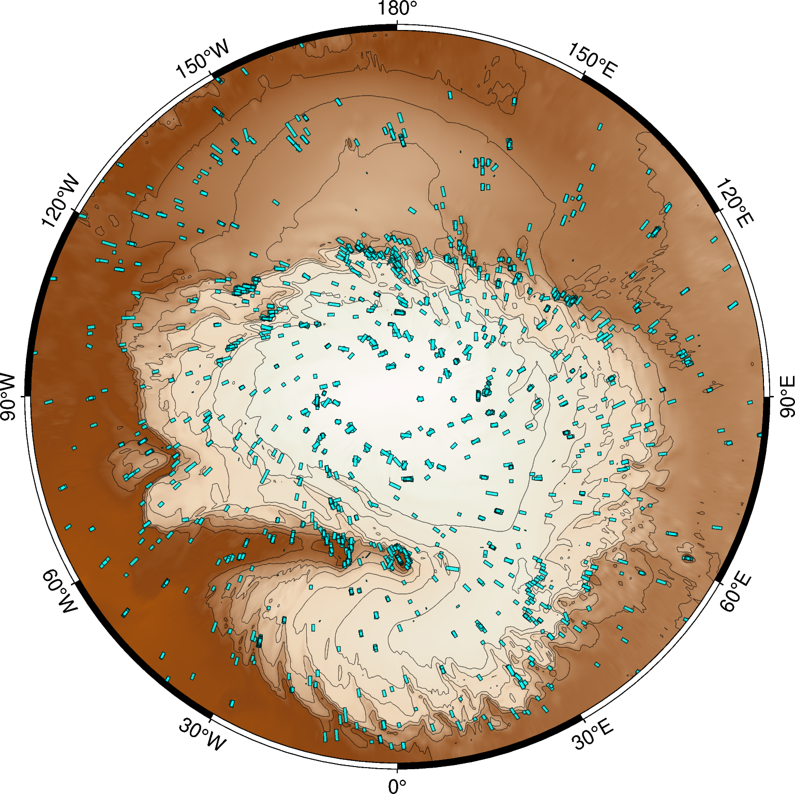

# HiRISE Data Explorer

This repository provides Python tools for filtering, retrieving, and mapping images captured by the High Resolution Imaging Science Experiment (HiRISE) camera onboard the Mars Reconnaissance Orbiter (MRO). Designed for planetary scientists, researchers, and enthusiasts, this toolkit streamlines the process of exploring multi-year image data and identifying areas of interest on the Martian surface.

## :key: Key Features

1. **Custom Filters and Image Retrieval**  
   Effortlessly filter and retrieve large sets of HiRISE images based on user-defined criteria. These custom filters allow you to refine queries by location, date, viewing geometry, and more.

2. **DBSCAN Clustering for Imaging Hotspots**  
   Identify multi-year imaging hotspots using Density-Based Spatial Clustering of Applications with Noise (DBSCAN). By grouping overlapping or closely spaced images, you can reveal areas of Mars with repeated HiRISE coverage.

3. **Shapely-Based Stack Selection**  
   Leverage the geometric capabilities of [Shapely](https://shapely.readthedocs.io/) to handle overlapping images. Automatically choose the best stacks from intersecting footprints and easily incorporate them into your data analysis or map displays.

4. **Visualization with PyGMT and QGIS**  
   Explore and share your results via robust visualization tools. Plot clustered hotspots with [PyGMT](https://www.pygmt.org/) or import your data into [QGIS](https://qgis.org/) for advanced cartographic work and interactive spatial analysis.

## :rocket: Getting Started

1. Clone the repository:

    ```bash
    git clone https://github.com/ZipZaap/DataExplorer.git
    ```

2. Create a virtual envirnement & install the required dependencies

    ```bash
    conda env create -f requirements.yml
    ```

## :open_file_folder: Repository Structure

```graphql
├───configs/
│   ├──config.yaml ---------------------- # File with defaults parameters
│   ├──config_parser.py ----------------- # Defines Config() class which stores the defaults
│   └──validators.py -------------------- # Defines validation logic and logging behavior
|
├───Core/
│   ├──filter.py ------------------------ # Image filtering tools
│   ├──mapper.py ------------------------ # Tools for visualiztion in QGIS/PyGMT
│   └──util.py--------------------------- # Misc utility functions
|
├───data/
│   ├───geojson/ ------------------------ # Storage for qgis .geojson files
│   ├───index/ -------------------------- # Storage for PDS .TAB & .LBL files
│   └───maps/ --------------------------- # Storage for PyGMT .png files
|
├───main.ipynb -------------------------- # Jupyter Notebook with examples
├───requirements.yml -------------------- # Core dependencies
└───README.md
```

> [!NOTE]
> Folders for storing QGIS/PyGMT visualizations and PDS index files (that contain the image metadata) are created and populated automatically, unless an exisiting storage path is specified in `configs.yaml`.

## :hammer_and_wrench: Basic Usage

1. **As module import**

    ```python
    from Core.filter import RdrFilter
    from Core.mapper import PyGMT, save_qgis_layer

    # initialize class instances
    explorer = RdrFilter()
    pygmt = PyGMT()

    # load df and perfrom latitude filtering without commiting the changes
    explorer.load_df()
    df = explorer.latitude_filter(commit = False)

    # render map with PyGMT and save to qgis layer
    pygmt.show_on_map(df, target = 'img_centroid', filename = 'allignment_flt')
    save_qgis_layer(df, target = 'img_centroid', filename = 'allignment_flt')

    # filter again, this time using custom LAT and saving the changes
    explorer.latitude_filter(min_lat = 80)

    # apply the rest of the filters with their default parameters
    explorer.scale_filter()
    explorer.season_filter()
    explorer.cluster_filter()
    explorer.my_filter()
    explorer.allignment_filter()

    # Show the logged parameters and save the filtered DataFrame
    print(explorer.local_conf)
    explorer.save_df()
    ```

2. **As standalone script**

    ```bash
    python filter.py
    ```

> [!TIP]
> Optimize your workflow by customizing the filter sequence in `configs.yaml` and setting sensible defaults applicable to your use case.

## :factory: Example use-case

In this example use-case we're looking to investigate the seasonal ice dynamics of the North Polar Layered Deposits (NPLD). For these purposes we need to isolate the HiRISE images of NPLD scraps, specifically focusing on locations that have continuos multi-year coverage. We use the following set of parameters:

```yaml
{
 'latitude_filter': {'min_lat': 78},
 'scale_filter': {'scale': 0.25},
 'season_filter': {'season': 'Northern summer'},
 'cluster_filter': {'algorithm': 'dbscan', 'min_samples': 2, 'epsilon': 2000},
 'keyword_filter': {'keywords': ['scarp']},
 'my_filter': {'min_years': 2, 'mys': [], 'consecutive': False},
 'allignment_filter': {}
}
```

### Filter sequence

<details>
<summary> Latitude filter </summary>


We use image corner coordinates to discard products acquired below `min_lat = 78`. Only the single-channel RED images are considered here.

**Code:**

```python
df = explorer.latitude_filter(commit = False)
pygmt.show_on_map(df, target = 'img_rectangle')
```

**Output:**

```text
LATITUDE FILTER ............. 5904 images
```

</details>

<details>
<summary> Scale filter </summary>


HiRISE dataset contains images with resolutions of `1`, `0.5` or `0.25` meters/pxl. We set `scale = 0.25` to keep only the high-res products.

**Code:**

```python
df = explorer.scale_filter(commit = False)
pygmt.show_on_map(df, target = 'img_rectangle')
```

**Output:**

```text
SCALE FILTER ................ 3699 images
```

</details>

<details>
<summary> Season filter </summary>



Using solar longitude we can define 4 distinct seasons for Southern and Northern hemispheres. Here we set `season = 'Northern Summer'`.

**Code:**

```python
df = explorer.season_filter(commit = False)
pygmt.show_on_map(df, target = 'img_rectangle')
```

**Output:**

```text
SEASON FILTER ................ 2081 images
```

</details>

<details>
<summary> Cluster filter </summary>


We perform density clustering of image centroids to identify areas with consistent coverage and discard outliers.

**Code:**

```python
df = explorer.cluster_filter(commit = False)
pygmt.show_on_map(df, target = 'img_rectangle')
```

**Output:**

```text
CLUSTER FILTER ................ 1503 images
```


Examples of DBSCAN clustering vizualized as image centroids (left) and actual area covered (right). Each color represents a separate cluster, with outliers labelled in gray. Location: (*Lon*<sub>1</sub>, *Lon*<sub>2</sub>, *Lat*<sub>1</sub>, *Lat*<sub>2</sub>) = (225&deg;, 240&deg;, 83.5&deg;, 84.5&deg;).

</details>

<details>
<summary> Keyword filter </summary>


We use rationale description (provided by HiRISE team), to further refine our selection. Here we set `keywords = ['scarp']`.

**Code:**

```python
df = explorer.keyword_filter(commit = False)
pygmt.show_on_map(df, target = 'img_rectangle')
```

**Output:**

```text
KEYWORD FILTER ................ 354 images
```

</details>

<details>
<summary> Mars Year filter </summary>


We filter clusters based on the sequence of unique (and optionally consecutive) mars years. Here `min_years = 2` and `consecuitive = False`.

**Code:**

```python
df = explorer.my_filter(commit = False)
pygmt.show_on_map(df, target = 'img_rectangle')
```

**Output:**

```text
MY FILTER ................ 334 images
```

</details>

<details>
<summary> Allignment filter </summary>


For each cluster, select the set of images that maximizes area overlap while ensuring each image represents a distinct Mars year.

**Code:**

```python
df = explorer.my_filter(commit = False)
pygmt.show_on_map(df, target = 'img_rectangle')
```

**Output:**

```text
MY FILTER ................ 203 images
```

</details>
